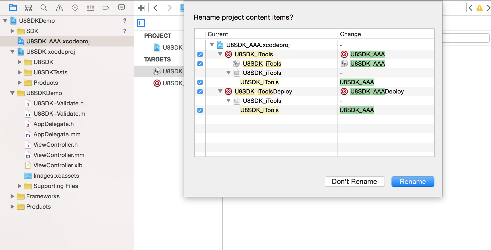
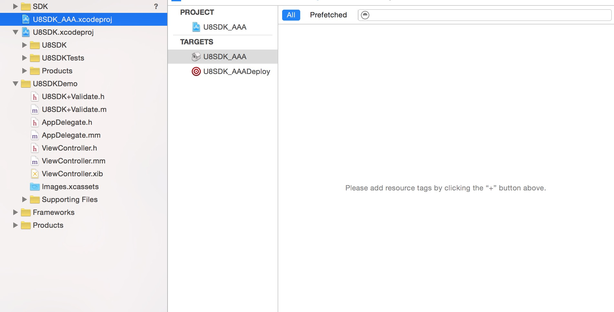
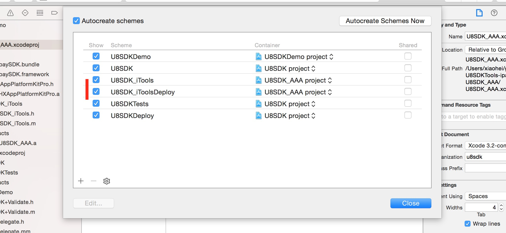
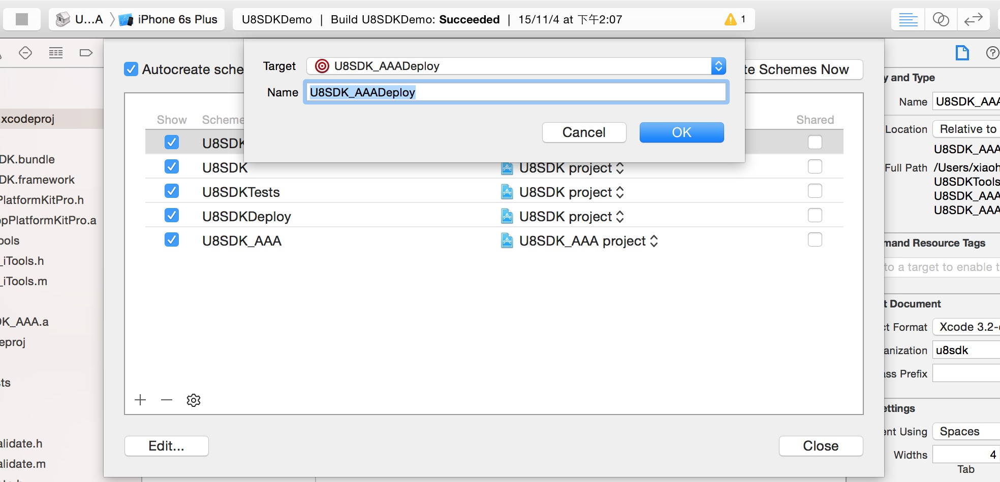

接入新渠道
===========

NOTE:在U8SDK框架基础上接入一个新渠道SDK，首先，心里请明确一点。接入过程和游戏工程没有半点联系，也就是说，游戏开发和SDK接入是完全解耦的。所以，接入的时候，不要想着游戏中怎样怎样，严格按照下面的步骤进行接入即可。
所有的接入工程都放在一个统一的目录，默认是放在打包工具根目录/Plugins目录下。所有接入工程的命名格式必须固定，统一为U8SDK_***


准备接入工程
-------

**1、拷贝一个已有的工程**

```
为了快速搭建一个新渠道SDK的接入工程，我们首先从一个已有的接入工程拷贝一份，并重新命名一下。比如我们现在要新接入一个新的渠道SDK：aaa。那么我们，在Plugins目录下，拷贝一个已有的接入工程，比如U8SDK_iTools工程。我们直接选中iTools工程，然后［Command＋D］，复制一份U8SDK_iTools工程，文件夹重命名为U8SDK_AAA

进入U8SDK_AAA目录，用xcode打开U8SDKDemo.xcodeproj，现在这个工程目录结构如下：
```

```
1、SDK目录：这个目录下存放当前渠道SDK需要的库文件和资源
2、U8SDK_iTools.xcodeproj:当前接入工程，接入工作就在这里完成
3、U8SDK.xcodeproj:引用的U8SDK抽象层工程
4、U8SDKDemo:当前的启动工程，接好之后，可以运行demo，在模拟器上直接测试看效果
5、Products:最终编译生成的静态库文件

```

**2、重命名接入工程，配置target**

```
上面我们打开了U8SDK_AAA这个工程，但是打开之后，接入工程还是U8SDK_iTools，我们需要重命名一下，修改为U8SDK_AAA:

1、左边选中U8SDK_iTools.xcodeproj
2、再轻轻点击一次，重命名一下这个文件，为U8SDK_AAA
3、这个时候，弹出重命名确认框，默认所有都选中，保持原样，然后点击rename，把相关target也进行重命名。
```


重命名之后，可以看到target也都重命名了：



然后，在Finder中到该工程目录下重命名U8SDK_iTools子目录为U8SDK_AAA，然后到xcode中删除U8SDK_iTools文件夹和里面的U8SDK_iTools.h和U8SDK_iTools.m文件。

将重命名之后的U8SDK_AAA目录拖到xcode工程中U8SDK_AAA.xcodeproj下面：


**3、配置Schemes**

```
上面target重命名之后，我们需要修改下Schemes，让我们在运行的时候，执行正确的target

点击菜单 Product->Scheme->Manage Schemes

```

```
把iTools这两个Scheme删除，直接选中，然后点击左下角［－］号，即可删除

删除这两个Scheme之后，我们再点击左下角［＋］再创建一个Scheme，用来在当前工程根目录下生成一个静态库文件:libU8SDK_AAA.a
```


到这里，我们这个新渠道aaa的接入准备工作已经完成了。接下来，我们就在这个接入工程中，来完成aaa渠道SDK的接入。


实现渠道SDK必须接入的方法
-------

NOTE:所有渠道SDK需要接入的方法，都大同小异。我们将其归为三大类：
1、初始化：	 大部分渠道都有初始化方法
2、用户相关：包含[登录]、[切换帐号]、[登出]、[个人中心]、[提交玩家数据]、[退出确认框]
3、支付：仅仅包含一个充值的接口

**1、引入SDK库和资源**

```
一般渠道SDK，都会提供一些库文件和资源文件，接入的时候，需要将这些文件拷贝到该工程下面SDK目录下，上面，我们这里SDK目录下还是iTools的库文件和资源。

这里，我们先删除这些库文件和资源，然后，加入aaa渠道SDK提供的库和资源文件。同时，在xcode工程中，也删除之前iTools的库和资源的引用，添加aaa需要的库和资源

```

**2、实现需要的方法**

我们将原来的U8SDK_iTools.h和U8SDK_iTools.m 重命名为 U8SDK_AAA.h和U8SDK_AAA.m，类文件中的对应的名称，也需要修改。

然后，选中U8SDK_AAA的target，在Build Phases 中，Compile Sources下面，如果还是U8SDK_iTools.m，那么删除这个，添加上U8SDK_AAA.m

U8SDK_AAA.h文件如下：

```
#import <Foundation/Foundation.h>
#import "U8Plugin.h"

#import "HXAppPlatformKitPro.h"

@interface U8SDK_AAA : U8Plugin<U8User, U8Pay>

@end

1、继承U8Plugin接口，
2、同时，实现U8User协议和U8Pay协议。
3、在U8SDK_AAA.m文件中实现U8PluginProtocol中的接口，进行渠道SDK的初始化，和AppDelegate中的一些系统方法接口。
3、在U8SDK_AAA.m文件中实现U8User和U8Pay中的接口。

这三个需要实现的Protocol如下：

// U8Plugin 插件接口
@protocol U8PluginProtocol

-(instancetype) initWithParams:(NSDictionary*)params;

@optional

-(void) setupWithParams:(NSDictionary*)params;

// UIApplicationDelegate事件
- (void)didFinishLaunchingWithOptions:(NSDictionary *)launchOptions;
- (void)applicationWillResignActive:(UIApplication *)application;
- (void)applicationDidEnterBackground:(UIApplication *)application;
- (void)applicationWillEnterForeground:(UIApplication *)application;
- (void)applicationDidBecomeActive:(UIApplication *)application;
- (void)applicationWillTerminate:(UIApplication *)application;

- (void)didRegisterForRemoteNotificationsWithDeviceToken:(NSData*)deviceToken;
- (void)didFailToRegisterForRemoteNotificationsWithError:(NSError*)error;
- (void)didReceiveLocalNotification:(UILocalNotification*)notification;
- (void)didReceiveRemoteNotification:(NSDictionary*)userInfo;

- (void)openURL:(NSURL*)url sourceApplication:(NSString*)sourceApplication annotation:(id)annotation;

@end

//U8User 账号登录相关接口
@protocol U8User

- (void) login;				//SDK登录
- (void) logout;
- (void) switchAccount;

- (BOOL) hasAccountCenter;
@optional
- (void) showAccountCenter;

//- (BOOL) isLogined;
//- (NSString*) getSessionID;

@end

//U8Pay 应用内购接口
@protocol U8Pay

-(void) pay:(NSDictionary*) profuctInfo;

@optional
-(void) openIAP;

@optional
-(void) closeIAP;

@optional
-(void) finishTransactionId:(NSString*)transactionId;

@end

```

然后，我们在U8SDK_AAA.m中根据需要实现上面三个协议中的对应的接口，我们这里的内容还是iTools的实现，我们看一下：

```

#import "U8SDK_AAA.h"
#import <AlipaySDK/AlipaySDK.h>

typedef enum
{
    StateDefault,
    StateIniting,
    StateInited,
    StateLogin,
    StateLogined
} SDKState;

@implementation U8SDK_AAA
{
    SDKState sdkState;
}

//////////////////////////////////////////////////////////////////////
#pragma mark - 处理 SDK 通知
//注册通知处理
- (void)registerNotification:(NSNotification *)notification
{
    NSLog(@"userId: %@", [notification.object objectForKey:@"userId"]);
    NSLog(@"userName: %@", [notification.object objectForKey:@"userName"]);
    NSLog(@"sessionId: %@", [notification.object objectForKey:@"sessionId"]);
}

//登录通知处理
- (void)loginNotification:(NSNotification *)notification
{
    NSLog(@"userId: %@", [notification.object objectForKey:@"userId"]);
    NSLog(@"userName: %@", [notification.object objectForKey:@"userName"]);
    NSLog(@"sessionId: %@", [notification.object objectForKey:@"sessionId"]);
    
    sdkState = StateLogined;
    
    NSDictionary* extension = [NSDictionary dictionaryWithObjectsAndKeys:
                                  [notification.object objectForKey:@"userName"], @"username",
                                  [notification.object objectForKey:@"userId"], @"uid",
                                  [notification.object objectForKey:@"sessionId"], @"sessionid",
                                  nil];
    
    [self eventUserLoginExt:extension];
}

//关闭窗口通知处理
- (void)closeViewNotification:(NSNotification *)notification
{
    NSLog(@"SDK View Closed");
}

//注销通知处理
- (void)logoutNotification:(NSNotification *)notification
{
    NSLog(@"Logout");
    [self eventUserLogout:nil];
}

- (void)closePayViewNotification:(NSNotification *)notification
{
    NSLog(@"SDK PayView Closed");
    NSLog(@"userId: %@", [notification.object objectForKey:@"userId"]);
    NSLog(@"userName: %@", [notification.object objectForKey:@"userName"]);
    NSLog(@"sessionId: %@", [notification.object objectForKey:@"sessionId"]);
    NSLog(@"orderIdCom: %@", [notification.object objectForKey:@"orderIdCom"]);
}

//监听服务器有可更新App的通知处理
- (void)updateApp:(NSNotification *)notification
{
    NSLog(@"server has app update");
    NSLog(@"userId: %@", [notification.object objectForKey:@"userId"]);
    NSLog(@"userName: %@", [notification.object objectForKey:@"userName"]);
    NSLog(@"sessionId: %@", [notification.object objectForKey:@"sessionId"]);
}

//监听钱包支付不成功的通知处理
- (void)payFailed:(NSNotification *)notification
{
    NSLog(@"wallet pay failed");
    NSLog(@"orderIdCom: %@", [notification.object objectForKey:@"orderIdCom"]);
    NSLog(@"userId: %@", [notification.object objectForKey:@"userId"]);
    NSLog(@"userName: %@", [notification.object objectForKey:@"userName"]);
    NSLog(@"sessionId: %@", [notification.object objectForKey:@"sessionId"]);
}

//////////////////////////////////////////////////////////////////////

//这里进行SDK的初始化
-(instancetype)initWithParams:(NSDictionary *)params
{
    [U8SDK sharedInstance].defaultUser = self;			//这个是必须的
    [U8SDK sharedInstance].defaultPay  = self;			//这个是必须的
    
    sdkState = StateDefault;
    
    NSString* appid = [params objectForKey:@"appid"];	//这里的key和渠道SDK的配置文件中定义的key需要一致
    NSString* appkey = [params objectForKey:@"appkey"];
    
    //设置充值平台分配的appid和appkey
    [HXAppPlatformKitPro setAppId:[appid intValue] appKey:appkey];
    
    return self;
}

-(void) didFinishLaunchingWithOptions:(NSDictionary *)launchOptions
{
    //设置支付宝回调所需的URL Scheme
    [HXAppPlatformKitPro setAlipayURLScheme:[[[NSBundle mainBundle] infoDictionary] objectForKey:(NSString *)kCFBundleIdentifierKey]];
    //设置支持的旋转方向
    [HXAppPlatformKitPro setSupportOrientationPortrait:NO portraitUpsideDown:NO landscapeLeft:YES landscapeRight:YES];
    
    //监听注册通知
    [[NSNotificationCenter defaultCenter] addObserver:self selector:@selector(registerNotification:) name:HX_NOTIFICATION_REGISTER object:nil];

    //监听登录通知
    [[NSNotificationCenter defaultCenter] addObserver:self selector:@selector(loginNotification:) name:HX_NOTIFICATION_LOGIN object:nil];
    
    //视图关闭通知
    [[NSNotificationCenter defaultCenter] addObserver:self selector:@selector(closeViewNotification:) name:HX_NOTIFICATION_CLOSEVIEW object:nil];
    
    //注销通知
    [[NSNotificationCenter defaultCenter] addObserver:self selector:@selector(logoutNotification:) name:HX_NOTIFICATION_LOGOUT object:nil];
    
    //处理支付视图时关闭的附加通知
    [[NSNotificationCenter defaultCenter] addObserver:self selector:@selector(closePayViewNotification:) name:HX_NOTIFICATION_CLOSE_PAYVIEW object:nil];
    
    //监听服务器有可更新App的通知
    [[NSNotificationCenter defaultCenter] addObserver:self selector:@selector(updateApp:) name:HX_NOTIFICATION_UPDATE_APP object:nil];
    
    //监听钱包支付不成功的通知
    [[NSNotificationCenter defaultCenter] addObserver:self selector:@selector(payFailed:) name:HX_NOTIFICATION_WALLET_PAY_FAILED object:nil];
}

-(void) openURL:(NSURL *)url sourceApplication:(NSString *)sourceApplication annotation:(id)annotation
{
    //跳转支付宝钱包进行支付，需要将支付宝钱包的支付结果回传给SDK
    if ([url.host isEqualToString:@"safepay"]) {
        [[AlipaySDK defaultService]
         processOrderWithPaymentResult:url
         standbyCallback:^(NSDictionary *resultDic) {
             NSLog(@"result = %@", resultDic);
             [HXAppPlatformKitPro alipayCallBack:resultDic];
         }];
    }
}

//实现SDK的登录
-(void) login
{
    [HXAppPlatformKitPro logout];
    [HXAppPlatformKitPro showLoginView];
}

//实现SDK的登出
-(void) logout
{
    [HXAppPlatformKitPro logout];
}

//实现SDK的切换账号
-(void) switchAccount
{
    [HXAppPlatformKitPro logout];
    [HXAppPlatformKitPro showLoginView];
}

//SDK是否要求游戏中提供［个人中心］按钮，点击可以进入SDK的个人中心界面
-(BOOL) hasAccountCenter
{
    return YES;
}

//显示SDK的个人中心界面
-(void) showAccountCenter
{
    [HXAppPlatformKitPro showPlatformView];
}

//实现渠道SDK的支付方法，打开渠道SDK的支付界面
-(void) pay:(NSDictionary*)productInfo
{
    int price = [[productInfo valueForKey:@"price"] intValue];
    NSString* productName = [productInfo valueForKey:@"productName"];
    NSString* orderId = [productInfo valueForKey:@"orderID"];

    //NSString* extension = [productInfo valueForKey:@"extension"];
    //NSString* serverName = [productInfo valueForKey:@"serverName"];
    //int buyNum = [[productInfo valueForKey:@"buyNum"] intValue];
    
    [HXAppPlatformKitPro payProductWithProductName:productName Amount:price OrderIdCom:orderId];
}

@end


```

触发U8SDK事件
-------

NOTE:接入工程中，在初始化成功;登录成功;登出成功;支付成功;等时刻，都需要往抽象层抛出对应的事件，以便抽象层中能够分发这些事件，这样游戏接入工程监听这些事件，就能做对应的逻辑处理。

对应的事件触发方法在U8Plugin中，因为上面U8SDK_AAA直接继承了U8Plugin，所以在U8SDK_AAA.m中，可以直接调用。我们看看这些事件：

```
#import "U8SDK.h"

@interface U8Plugin : NSObject<U8PluginProtocol>

-(UIView*) view;										//获取当前的UIView
-(UIViewController*) viewController;					//获取当前的UIViewController


-(void) eventPlatformInit:(NSDictionary*) params;		//初始化成功的时候，调用
-(void) eventUserLogin:(NSDictionary*) params;			//直接使用eventUserLoginExt即可
-(void) eventUserLoginExt:(id) extension;				//登录成功的时候，调用
-(void) eventUserLogout:(NSDictionary*) params;			//登出成功的时候，调用
-(void) eventPayPaid:(NSDictionary*) params;			//支付成功的时候，调用

比如上面在SDK通知的登录成功的回调方法loginNotification中，我们触发了eventUserLoginExt事件，同时将登录验证需要的参数，放在了一个Dictionary中，这些参数在去U8Server做二次登录认证的时候，会转换成json放到extension字段中。

所以，这里的名称是什么，U8Server那边也按照对应的key，按照json格式进行解析即可。

@end

```

配置编译参数
-------

NOTE: 我们在每个渠道SDK的根目录下，都有一个xcode_process.py文件，用来配置当前渠道SDK的编译参数信息，同时也定义了一个自定义脚本的处理接口，用来实现特殊操作。

```
文件内容如下：

# -*- coding: utf-8 -*-

mods = {
    "group": "U8SDK_AAA",
    "files": [
        "libU8SDK_AAA.a",
    ],
    "folders": [
        "SDK"
    ],
    "frameworks": [
        "MobileCoreServices.framework",
        "AdSupport.framework",
        "UIKit.framework"
    ],
    "libs": [
        "libsqlite3.dylib"
    ]
}

def post_process(self, project, infoPlist, sdkparams):

    self.addBundleURLType(CFBundleTypeRole="Editor", CFBundleURLSchemes=[self.getBundleId()])
    
    infoPlist['UIViewControllerBasedStatusBarAppearance'] = False

1、mods：配置添加到xcode工程中的库和文件等。
	group：添加到工程中的group
	files：添加到工程中的文件
	folders：添加到工程中的文件夹，SDK下面是当前渠道SDK提供的各种库文件和资源文件
	frameworks：添加到工程中的系统的frameworks，注意：这里添加的都是当前渠道SDK需要依赖的系统的framework
	libs：添加到工程中的系统的lib文件，注意：这里添加的都是当前渠道SDk需要依赖的系统的lib

2、post_process：当前渠道SDK的自定义脚本
	self:当前类空间，可以用self调用XcodeProcess类中所有方法。这个类在buildscript/xcode_gen.py文件中
	project:当前工程对象
	infoPlist:info.plist对象，是一个字典结构
	sdkparams:当前渠道SDK的配置参数，是一个字典结构

```

到这里，我们上面接入成功之后，我们可以运行之前我们重命名之后的名为U8SDK_AAADeploy的Scheme，编译成功之后，会在根目录下生成一个名为libU8SDK_AAA.a的静态库文件。

配置渠道SDK参数
-------------

```
渠道参数的配置，例如，渠道分配的appID，appKey，SecretKey等参数，各个游戏都不相同，所以，我们需要将这些参数配置在各个游戏的工作目录中。

所以，我们在各个游戏的工作目录中，我们都需要建立一个channels子目录，用于存放各个渠道的参数配置，和特殊资源。比如，AAA渠道，我们在channels目录下，新建一个AAA目录，然后在这个目录中，新建一个config.json，内容如下：

{
    "desc":"AAA SDK",
    "U8SDK": {
        "Channel": 2001
    },
    "plugins": [
        {
            "name": "AAA",          //这里的名称必须和接入工程目录名称_之后的匹配。
                                    //比如我们接入工程叫U8SDK_AAA，那么这里的name就是AAA
            "appid": "1",           //在initWithParams中，我们根据这里的key解析参数
            "appkey": "58C6A68DDDEE471AA43266E427F38D92"    //在initWithParams中，我们根据这里的key解析参数
        }
    ]
}

desc：当前渠道的名称或者说明
U8SDK：和common下的config.json中的U8SDK节点的内容会合并到一起。
     ---Channel:当前渠道的渠道号
plugins:这里是配置当前渠道支持的插件，注意这里是数组，这里支持将多个插件组合在一起，比如，我们接AppStore的时候，AppStore只有一个支付功能，我们还需要接入一个登录功能，我们希望使用Facebook登录。那么，我们可以独立接入AppStore和Facebook，然后在这里，配置这两个插件
    ---name:渠道名称，渠道SDK接入工程命名规则时U8SDK_***;这里的名称，必须和***一致。比如插件工程命名为U8SDK_iTools，那么这里的name的值必须为iTools.
    ---其他渠道参数，代码中或者自定义脚本中需要的参数，都可以在这里添加，key和读取的时候，保持一致即可

```

配置ICON角标
-------------

NOTE:部分渠道没有角标要求，我们可以直接将游戏的ICON放在游戏工作目录中的common目录中，同样命名为AppIcon.appiconset，结构和下图一致。这样，没有角标需求的渠道的ICON，将默认使用这个。

```
如果渠道SDK有要求ICON加角标，那么需要让美术同学做好对应的带有角标的ICON，按照固定的方式，存放在游戏工作目录／channels下改渠道的配置目录。在名称为AppIcon.appiconset的目录下，存放对应尺寸的图片，命名格式和文件结构如下：

可以从其他渠道配置目录中，拷贝一份，然后交给美术，按照要求做好，再替换进来。

```


配置渠道SDK闪屏
-------------

NOTE:部分渠道有闪屏要求，一般我们可以在游戏工作目录中的common目录中，放上通用的闪屏文件，同样的命名为LaunchImage.launchimage，结构和下图一样。对于没有闪屏的渠道SDK，默认将使用这里的闪屏

```
各个渠道的闪屏文件，按照固定的格式，放在改游戏工作目录／channels下该渠道的配置目录。在名称为LaunchImage.launchimage的目录下，存放对应尺寸的图片，命名格式和文件结构如下图：

可以从其他渠道配置目录中，拷贝一份，然后交给美术，按照要求做好，再替换进来。

```

