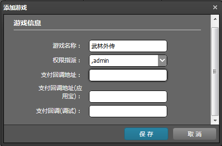

IOS游戏接入指南
======

NOTE:这篇文档，基于最新版本的U8SDK框架，如果发现该文档和你使用的版本不匹配，则以你使用的版本对应的文档为准。

NOTE:2016年12月12号以前的版本，请看这里：[抽象层API调用](quickstart.md)

添加framework和bundle
-------

把U8SDK.framework加入xcode工程

必须调用的接口
-------

#### 初始化(必接)

初始化应该在程序启动时调用, 也就是在didFinishLaunchingWithOptions方法里

```
- (BOOL)application:(UIApplication *)application didFinishLaunchingWithOptions:(NSDictionary *)launchOptions {

    NSDictionary *sdkconfig = [[NSBundle mainBundle] objectForInfoDictionaryKey:@"U8SDK"];
    [[U8SDK sharedInstance] initWithParams:sdkconfig];
    
    [[U8SDK sharedInstance] application:application didFinishLaunchingWithOptions:launchOptions];
    
    [[U8Analytics sharedInstance] startLevel:@"1"];
    
    return YES;
}
```

#### AppDelegate事件处理

U8SDK会把这些事件跟第三方SDK进行桥接
```
-(void)application:(UIApplication *)application didRegisterForRemoteNotificationsWithDeviceToken:(NSData *)deviceToken
{
    [[U8SDK sharedInstance] application:application didRegisterForRemoteNotificationsWithDeviceToken:deviceToken];
}


-(void)application:(UIApplication *)application didReceiveRemoteNotification:(nonnull NSDictionary *)userInfo
{
    [[U8SDK sharedInstance] application:application didReceiveRemoteNotification:userInfo];
}

-(void)application:(UIApplication *)application didReceiveRemoteNotification:(NSDictionary *)userInfo fetchCompletionHandler:(void (^)(UIBackgroundFetchResult))completionHandler
{
    [[U8SDK sharedInstance] application:application didReceiveRemoteNotification:userInfo];
}

-(void)application:(UIApplication *)application didReceiveLocalNotification:(UILocalNotification *)notification
{
    [[U8SDK sharedInstance] application:application didReceiveLocalNotification:notification];
}

- (void)applicationWillResignActive:(UIApplication *)application {
    [[U8SDK sharedInstance] applicationWillResignActive:application];
}

- (void)applicationDidEnterBackground:(UIApplication *)application {
    [[U8SDK sharedInstance] applicationDidEnterBackground:application];
}

- (void)applicationWillEnterForeground:(UIApplication *)application {
    [[U8SDK sharedInstance] applicationWillEnterForeground:application];
}

- (void)applicationDidBecomeActive:(UIApplication *)application {
    [[U8SDK sharedInstance] applicationDidBecomeActive:application];
}

- (void)applicationWillTerminate:(UIApplication *)application {
    [[U8SDK sharedInstance] applicationWillTerminate:application];
}

-(BOOL)application:(UIApplication *)application handleOpenURL:(NSURL *)url
{
    return [[U8SDK sharedInstance] application:application handleOpenURL:url];
}

-(BOOL)application:(UIApplication *)application openURL:(NSURL *)url sourceApplication:(NSString *)sourceApplication annotation:(id)annotation
{
    return [[U8SDK sharedInstance] application:application openURL:url sourceApplication:sourceApplication annotation:annotation];
}
```

#### 设置U8SDK回调代理

在初始化成功后, 还需要设置U8SDK的回调函数, 回调对象需要实现U8SDKDelegate的各个接口

```
    [[U8SDK sharedInstance] setDelegate:self];
```

#### 二阶初始化接口

这个接口是在程序首个界面加载完成之后调用的
```
    [[U8SDK sharedInstance] performSelector:@selector(setupWithParams:) withObject:nil afterDelay:0];
```

#### 登录接口(必接)

```
    [[U8SDK sharedInstance] login];
```

#### 登出接口(选接)

```
    [[U8SDK sharedInstance] logout];
```

#### 提交扩展数据(必接)

```
    U8UserExtraData* extraData = [[U8UserExtraData alloc] init];
    extraData.dataType = TYPE_ENTER_GAME;
    extraData.roleID = @"testRole";
    extraData.roleName = @"角色名称";
    extraData.serverID = 1;
    extraData.serverName = @"第一区";
    extraData.roleLevel = @"1";
    extraData.moneyNum = 100;
    extraData.roleCreateTime = time(NULL);
    extraData.roleLevelUpTime = time(NULL);
    
    [[U8SDK sharedInstance] submitExtraData:extraData];
```

#### 支付充值(必接)

```
    U8ProductInfo* productInfo = [[U8ProductInfo alloc] init];
    productInfo.productName = @"30钻石";
    productInfo.productDesc = @"30钻石";
    productInfo.productId = @"htage_8";
    productInfo.price = [NSNumber numberWithInt:30];
    productInfo.buyNum = 30;
    productInfo.roleId = @"12345";
    productInfo.roleName = @"角色";
    productInfo.roleLevel = @"66";
    productInfo.serverId = @"1";
    productInfo.serverName = @"桃源";
    productInfo.vip = @"1";
    
    [[U8SDK sharedInstance] pay:productInfo];
```

打出渠道包
-------

上面代码写好之后, 这个xcode就是以后打渠道包的母工程。 接下来，就可以通过U8SDK一键打包工具，打出各个渠道的渠道包。

1、U8Server创建游戏，生成参数

进入U8Server管理后台，选择 游戏管理-》新建 创建一个新游戏， 创建游戏的时候， 会生成该游戏的 appID，appKey,appSecret等参数。



添加完游戏之后， 选中该游戏， 点击 菜单中【详情】 查看 该游戏生成的 appID， appKey等参数， 需要将appID和appKey告诉客户端同学，客户端同学，需要将这两个参数，配置到打包工具中(见下面)。


2、打包工具中创建游戏目录


2.1 客户端打包工具中，我们需要在U8SDKTool-Win-P34/games目录下，创建一个游戏目录(英文或者拼音命名)，比如叫game2，作为该游戏的打包工具配置目录。

**为了方便，将我们提供的game1中所有的东西，拷贝过来。**

然后，将上面我们打出的母包apk，重命名为u8.apk， 放到game2目录下

2.2 为了让打包工具，知道有这个游戏配置目录。 我们需要在games.xml中， 添加一条game记录。

~~~~~~

    <game>
        <param name="appName" value="game2" />     <!--游戏配置目录名称，上面目录是game2，这里就是game2-->
        <param name="appID" value="2" />            <!--U8Server生成的该游戏的appID-->
        <param name="appKey" value="f32fdc02123a82524eb4ea95e1383d0b" />  <!--U8Server生成的该游戏的appKey-->
        <param name="appDesc" value="测试游戏2" />
        <param name="orientation" value="landscape" desc="游戏是横屏还是竖屏(landscape|portrait),不配置默认是横屏" />        
        <param name="cpuSupport" value="armeabi|armeabi-v7a|x86|mips"/>     
        <param name="outputApkName" value="{channelName}_{buildNum}.apk" />     
    </game>

~~~~~~

打包工具中详细说明，以及各个配置字段的详细说明，可以看[打包工具详细说明文档](android_package.md)

3、配置游戏参数

**将上面game记录中的appID和appKey 设置为 U8Server后台创建游戏时，生成的appID和appKey的值**

4、打出渠道包

现在执行package.bat，选择游戏列表中，应该已经有这条game2了。 输入appID，进行渠道包的打包操作，就可以打出渠道包了。


