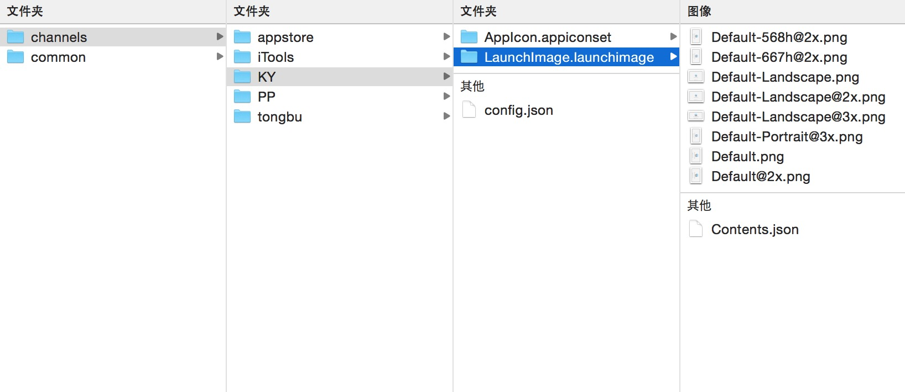
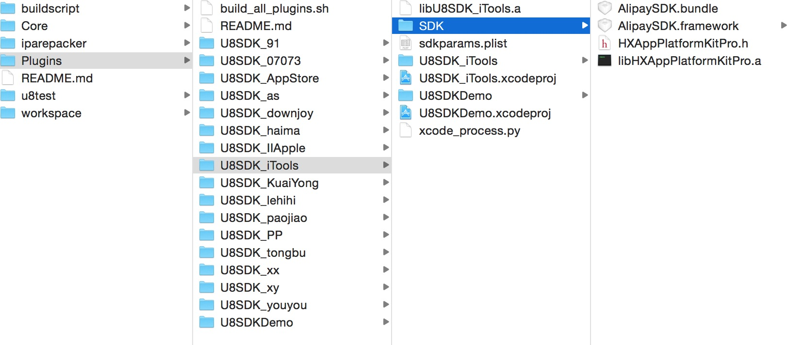

打包工具说明
===========

Android平台打包工具
-------

NOTE:打包工具根目录为：U8SDKTool-Win-P34；运行打包工具之前，请先参考 [[环境搭建]](setup.md) 进行python环境的安装。打包工具是用python写的。
另外，建议先看下打包工具的实现原理：[[U8SDK打包工具原理]](http://www.uustory.com/?p=1472)

**1、目录说明**

```
config:所有sdk,插件都放在这里;同时还包含keystore和闪屏文件
	---keystore:apk打包使用的全局keystore配置目录
	---plugin:当前支持的所有插件
	---sdk:当前所有支持的渠道sdk
	---splash:闪屏文件

games:所有游戏配置目录，这个也是我们配置和操作比较频繁的目录
	---games.xml:游戏配置文件，所有当前需要打包的游戏，都配置在这里
	---game1:测试游戏目录
		---channels:每个游戏下每个渠道特殊的资源目录，所有游戏目录下都可以有这个文件夹
		---icon:放置游戏的ICON，大小512*512.名称必须为icon.png。用于渠道角标的自动处理
		---keystore:当前游戏的keystore文件目录
		---plugin:当前游戏对应的plugin配置目录
		---res:当前游戏的特殊资源目录，按照Android工程结构放置
		---root:需要放到apk根目录下的文件或者目录
		---scripts:游戏自定义脚本，目前只有一个post_script.py
		---其他目录为游戏自定义目录（可能在自定义脚本中需要用到的目录）
	---game2:测试2游戏目录
		---同game1

log:日志目录，每次打包都会在该目录下生成一个u8sdk.log

output:渠道包生成目录。打包结束，在该目录下生成对应的渠道包

scripts:打包脚本原码目录

tool:打包工具使用到的第三方工具目录

workspace:打包过程临时工作目录(可用于查BUG等)

others-tools:CPS包等打包工具，对于只需要基于原包，输出一个仅仅渠道号不同的CPS包，使用这里的工具

local和updates目录，主要用于渠道SDK的生成更新包，以及检测更新使用，具体功能可以看博客

package.bat:正常打包脚本
package-all-multithread.bat:开启3个线程，打出所有配置的渠道包
sdk-generate-update.bat：生成当前需要更新的SDK
sdk-check-update.bat：检查当前有更新的SDK，并更新
```

**2、新增一个游戏目录**

```
（1）新增一个游戏时，需要在games目录下，新建一个全部小写(拼音或者英文)的游戏名称。
（2）打开games/games.xml，增加一个game子节点配置，配置上新的游戏，其中appName必须和上面新建的目录名称一致

	<game>
		<param name="appName" value="game1" desc="游戏名称，必须和文件夹名称一致"/>
		<param name="appID" value="1" desc="u8server分配给该游戏的appID"/>
		<param name="appKey" value="f32fdc02123a82524eb4ea95e1383d0b" desc="u8server分配给该游戏的appKey"/>
		<param name="appDesc" value="测试游戏1" desc="当前游戏的中文名称"/>
		<param name="orientation" value="landscape" desc="游戏是横屏还是竖屏(landscape|portrait),不配置默认是横屏" />
		<param name="cpuSupport" value="armeabi|armeabi-v7a" desc="当前游戏支持的cpu类型"/>
		<param name="use_u8_auth" value="1" desc="是否用U8SDK默认的登录认证" />
		<param name="u8_auth_url" value="http://192.168.18.9:8080/user/getToken" desc="如果这里配置了登录认证地址，那么会覆盖local.properties中配置的登录认证地址"/>		
		<param name="versionCode" value="15" desc="游戏包的版本号,对应AndroidManifest.xml中的versionCode"/>
		<param name="versionName" value="2.8.5" desc="游戏包中的版本名称,对应AndroidManifest.xml中的versionName"/>
		<param name="minSdkVersion" value="8" desc="最小支持的Android SDK版本，minSdkVersion,targetSdkVersion,maxSdkVersion 三个同时配置，或者同时不配置"/>
		<param name="targetSdkVersion" value="20" desc="默认使用的Android SDK版本，minSdkVersion,targetSdkVersion,maxSdkVersion 三个同时配置，或者同时不配置"/>
		<param name="maxSdkVersion" value="22" desc="最大支持的Android SDK版本，minSdkVersion,targetSdkVersion,maxSdkVersion 三个同时配置，或者同时不配置"/>
		<param name="outputApkName" value="{channelName}.apk" desc="最终apk包名格式：{bundleID}:包名,{versionName}:版本名称,{versionCode}:版本号,{time}:时间戳(yyyyMMddmmss),{channelID}:渠道号,{channelName}:渠道名,{appName}:游戏名,{appID}:appID"/>	
	</game> 	

（3）从其他游戏配置目录下，拷贝一份channels和keystore过来，同时拷贝config.xml和keystore.xml两个配置文件
     
    将channels目录下的已有内容删除
	 
	keystore目录下，换成自己重新生成的keystore文件
	 
	config.xml中，所有sdk-params里面的参数值，替换为当前游戏的分配的值
	
	keystore.xml中，将keystore配置，改为自己生成的keystore信息

（4）将打好的母包，放在当前目录下，并命名为u8.apk

```

OK，到这里，你就可以执行package.bat，按照提示，选择你当前这个游戏，打一个渠道包玩玩了~


**渠道配置**
	
```
每个游戏需要打包的渠道和渠道配置都在打包工具/games/当前游戏/config.xml中。每个渠道对应一个channel节点的渠道配置


	<channel>
		<param name="id" value="10" />
		<param name="name" value="uc" />
		<param name="sdk" value="uc" />
		<param name="desc" value="UC SDK" />
		<param name="suffix" value=".uc" />	
		<param name="splash" value="0" />
		<param name="splash_copy_to_unity" value="0" />
		<param name="icon" value="rb" />
		<param name="gameName" value="大话西游" />
		<param name="signApk" value="0" />
		<param name="extraR" value="com.ali.uc" />

		<sdk-params>
			<param name="UCGameId" value="544156" desc="GameId"/>
			<param name="UCCpId" value="55398" desc="CpId"/>
			<param name="UCDebugMode" value="false" desc="是否开启调试模式(true|false)"/>
		</sdk-params>

		<plugins>
			<plugin name="download" desc="apk 下载插件" />
		</plugins>

		<sdk-version>
			<versionCode>1</versionCode>   <!--versionCode用于渠道SDK的更新使用-->
			<versionName>4.0</versionName><!--versionName用于标识当前SDK的版本，和渠道SDK的版本一致-->
		</sdk-version>	

	</channel>


id:一号通分配的渠道号
name:渠道名称，保证唯一性
sdk:当前使用的SDK目录名称
desc:SDK 注明
suffix:包名后缀，也可以配置全包名
splash:闪屏类型
splash_copy_to_unity:拷贝闪屏到Unity默认闪屏（Unity工程项目适用）
icon:是否处理角标，角标位置是rb（right-bottom）具体类型详情，可以看[这篇博客](http://www.uustory.com/?p=1778)
gameName:如果渠道包的游戏名称特殊，可以配置这里，将覆盖母包的游戏名称
signApk:是否对最终的apk包进行签名。默认是签名的，如果不需要签名，则设置为0
extraR:是否需要在其他的包名下面生成R.java，多个包名，用逗号分割(一般用于海外渠道)
sdk-version:用于和u8server对比使用的版本
sdk-params:当前渠道的参数配置
plugins:当前渠道支持的插件

```

**3、母包相关**

```
（1）母包是指接入了U8SDK抽象层（U8SDK2）的游戏，所打出的apk包
（2）每个游戏都有一个母包
（3）母包必须放在游戏配置目录下，并以u8.apk命名
（4）母包直接安装是没有渠道SDK的，必须经过打包工具打包
```

**4、ICON配置**

```
ICON支持两种配置方式：

1)、ICON自动处理

* 在打包工具/games/当前游戏/icon目录下，放一张icon.png(不带任何角标)， 大小必须为512*512像素
* 在渠道参数配置文件（打包工具/games/当前游戏/config.xml）中， 该渠道的通用参数中，增加一条如下配置：

<param name="icon" value="rb" />

这里的值的含义，代表着角标所在的位置。

rb -->right bottom --角标位于ICON的右下角
rt -->right top    --角标位于ICON的右上角
lb -->left bottom  --角标位于ICON的左下角
lt -->left top     --角标位于ICON的左上角 

关于这里值的含义和详细处理原理，可以参考[这篇博客](http://www.uustory.com/?p=1778)

这样配置之后，打包脚本会根据配置，自动将角标附加到游戏Icon上面

2)、直接覆盖方式：

如果觉得打包工具自动处理的缩放有损，导致图标模糊，那么可以让美术最好各种分辨率的ICON，然后在每个游戏配置目录下有channels目录，用来配置渠道的特殊资源

我们就利用这个目录，来完成各个渠道ICON的配置

比如UC(渠道号503)是需要角标的，事先我们让美术制作几种尺寸的带UC角标的ICON，几种尺寸为：

	36*36 	-->drawable-ldpi
	48*48 	-->drawable-mdpi
	72*72 	-->drawable-hdpi
	96*96 	-->drawable-xhdpi
	144*144 -->drawable-xxhdpi
	192*192 -->drawable-xxxhdpi

然后，在channels目录下，新建一个503的子目录，作为当前渠道的特殊资源目录，然后在新建一个res的子目录
里面放置所有ICON的图片，图片名称和母包中AndroidManifest.xml的application节点中配置的名称要一致。
Unity导出的话，ICON名称为app_icon.png

那么，就是这样：
channels/503/res/drawable-ldpi/app_icon.png (尺寸为36*36)
channels/503/res/drawable-mdpi/app_icon.png (尺寸为48*48)
channels/503/res/drawable-hdpi/app_icon.png (尺寸为72*72)
channels/503/res/drawable-xhdpi/app_icon.png (尺寸为96*96)
channels/503/res/drawable-xxhdpi/app_icon.png (尺寸为144*144)
channels/503/res/drawable-xxxhdpi/app_icon.png (尺寸为192*192)
```

**5、闪屏配置**

```
有些渠道SDK要求启动画面，必须显示一张渠道的启动图。这个一般显示两三秒种，然后小时，启动游戏。

现在的流程是：

如果渠道要求闪屏：
	显示渠道闪屏-》显示游戏闪屏-》进入游戏
如果渠道没有要求闪屏：
	显示游戏闪屏-》进入游戏

目前，有要求闪屏的渠道，他们的闪屏文件，放在渠道SDK配置目录下splash目录，比如当乐渠道的闪屏文件放在
	config\sdk\downjoy\splash目录下

考虑到闪屏有以下分类

		横屏（1）   		竖屏（2）
	白色背景（1）		黑色背景（2）

我们采用一种简便的方式来组合配置（数字组合）

	横屏白色背景：11
	横屏黑色背景：12
	竖屏白色背景：21
	竖屏黑色背景：22

那么，splash目录下，我们理论上，需要这四个子目录，来分别存放几种类型的闪屏文件。但是，当前只用11一种方式，如果你的游戏是竖屏
那么，你需要在对应的渠道的splash中，增加一个21或者22的子目录，来存放竖屏的闪屏文件。

闪屏文件有了，我们怎么知道打包的时候，某个渠道要用哪种闪屏文件呢？
在游戏配置目录下config.xml中，配置各个渠道的时候，有两个参数：

	<param name="splash" value="0" />
	<param name="splash_copy_to_unity" value="0" />

splash的value可以为11,12,21,22，分别指定使用哪种闪屏文件，如果不需要闪屏，设置为0
splash_copy_to_unity的value可以为1，说明当前游戏为Unity游戏，直接将闪屏文件替换为Unity默认的闪屏文件。如果不需要闪屏，设置为0

```

**6、keystore签名文件配置**
	
```
所有apk包，必须被签名之后，才能被手机安装。为了防止签名冲突，我们需要为每个游戏指定签名文件
签名文件可以通过eclipse或者android studio来生成

生成的签名文件(.keystore)，放置在当前游戏目录下keystore子目录中，然后在游戏目录下keystore.xml中，增加或者修改配置

	<default>

		<param name="keystore" value="config/keystore/u8_default.keystore" />
		<param name="password" value="u8sdk123" />
		<param name="aliaskey" value="u8sdkkey" />
		<param name="aliaspwd" value="u8sdk123" />	

	</default>

	<keystores>

		<channel>
			<param name="channelId" value="11" />
			<param name="channelName" value="downjoy" />
			<param name="keystore" value="config/games/game1/keystore/downjoy.keystore" />
			<param name="password" value="downjoy_1316" />
			<param name="aliaskey" value="1316" />
			<param name="aliaspwd" value="downjoy_1316" />					
		</channel>

		<channel>
			<param name="channelId" value="40" />
			<param name="channelName" value="lewan" />
			<param name="keystore" value="config/games/game1/keystore/lewanduo.keystore" />
			<param name="password" value="lewanduo" />
			<param name="aliaskey" value="lewanduo" />
			<param name="aliaspwd" value="lewanduo" />					
		</channel>	
		
	</keystores>

default中，配置默认的签名文件，没有指定的渠道，都使用默认的签名文件来完成签名
channel是用来配置渠道独立的签名文件，部分渠道要求使用他们提供的签名文件，这里可以在channel中配置。
```


**7、游戏特殊资源配置**

```
某些时候，我们需要在每个渠道包中，加入当前游戏的一些特殊资源，比如game1，我们需要在assets中，放入tips文件
但是，我们又不希望每次改这个tips文件，都去重新打一个母包。所以，我们采用将tips文件，作为X三国游戏的特殊资源
放在特殊资源目录

游戏目录/res目录就是专门为游戏提供的特殊资源目录，里面文件目录结构和Android工程一致
res
	---assets
	---res
	---libs
目前仅仅支持上面三种子目录，其他暂不支持
```

**8、游戏apk根目录资源**

```
某些情况下，我们需要在apk根目录下放置一些目录或者文件，但是打包工具的原理是反编译二次打包，二次打包的时候，无法将apk根目录下的资源重新打进包中，所以，我们要避免在母包中放置类似资源。

如果有这种要求，那么就将这些资源放置在游戏目录/root目录下

这里的所有文件或者目录，都会直接添加到apk根目录中
```

**9、游戏自定义脚本**

```

每个游戏可能都有自己特殊的一些操作需要处理。比如game1，我们需要提供全资源包和非全资源包的选择性打包，我们将一些地址配置到ip_config.txt中，然后希望通过脚本，将ip_config.txt中的key和value添加到AndroidManifest.xml的meta-data中。

省的每次改地址，都需要重新打母包，我们还可以将版本号等，都放在配置中，打包的时候，写入到AndroidManifest.xml中等

那么，这个时候，我们就需要自定义脚本来实现这些特殊的功能。目前，支持脚本：

post_script.py: 后置执行脚本
	---execute:这个方法在每个渠道资源合并之后，重新打包之前执行

```

**10、新SDK配置**
	
```
当接好了一个新的渠道SDK时，需要将其配置到打包工具中，比如新接了一个UC的渠道，那么就在config/sdk/目录下，新建一个uc的子目录
然后，按照SDK接入文档中说的，将需要的config.xml，SDKManifest.xml，jar包，libs,res,assets等拷贝到这里。
（这块具体参考SDK接入文档）

然后，如果某个游戏要使用当前渠道SDK，则直接在游戏目录下config.xml中，增加一个渠道配置：

	<channel>
		<param name="id" value="10" />
		<param name="name" value="uc" />
		<param name="sdk" value="uc" />
		<param name="desc" value="UC SDK" />
		<param name="suffix" value=".uc" />	
		<param name="splash" value="0" />
		<param name="splash_copy_to_unity" value="0" />
		<param name="icon" value="rb" />
		<param name="gameName" value="大话西游" />
		<param name="signApk" value="0" />

		<sdk-params>
			<param name="UCGameId" value="544156" desc="GameId"/>
			<param name="UCCpId" value="55398" desc="CpId"/>
			<param name="UCDebugMode" value="false" desc="是否开启调试模式(true|false)"/>
		</sdk-params>

		<plugins>
			<plugin name="download" desc="apk 下载插件" />
		</plugins>

		<sdk-version>
			<versionCode>1</versionCode>   <!--versionCode用于渠道SDK的更新使用-->
			<versionName>4.0</versionName><!--versionName用于标识当前SDK的版本，和渠道SDK的版本一致-->
		</sdk-version>	

	</channel>


id:一号通分配的渠道号
name:渠道名称，保证唯一性
sdk:当前使用的SDK目录名称
desc:SDK 注明
suffix:包名后缀，也可以配置全包名
splash:闪屏类型
splash_copy_to_unity:拷贝闪屏到Unity默认闪屏（Unity工程项目适用）
icon:是否处理角标，角标位置是rb（right-bottom）具体类型详情，可以看博客
gameName:如果渠道包的游戏名称特殊，可以配置这里，将覆盖母包的游戏名称
signApk:是否对最终的apk包进行签名。默认是签名的，如果不需要签名，则设置为0
sdk-version:用于和u8server对比使用的版本
sdk-params:当前渠道的参数配置
plugins:当前渠道支持的插件

```


iOS平台打包工具
-------

NOTE:iOS打包工具根目录为U8SDKTools-ipa,打包工具和android平台打包工具一样，采用python实现。无需安装任何第三方库，支持Mac自带的python2.7版本。

**1、目录说明**

```
buildscript: 打包脚本源码目录
Core: U8SDK抽象层框架工程目录
iparepacker:仅仅渠道号不同的ipa包，打包工具。（CPS包）
Plugins:所有渠道SDK接入工程目录
workspace:测试游戏工作目录
	---common:该游戏通用配置目录
	---channels:当前游戏中各个渠道SDK的配置
	---projects:打包生成的临时工程目录
	---release:最终渠道包的存放位置
```

**2、游戏目录的配置**

```
iOS中打包方式基于母工程来完成，所以，我们采用了更加灵活的方式，来指定母工程的位置：

在打包工具的运行命令的参数中指定游戏工程的位置。

打包的时候，先将母工程，拷贝出来一份，作为当前渠道的工作工程，所以，我们需要指定一个工作目录，将所有的需要的基础配置和各个渠道的参数配置，各个渠道打包生成的临时工程，以及存储最终生成的渠道包。

所以，打包的时候，执行命令，同时需要指定母工程的位置（指定到xcodeproj）和当前游戏的工作目录
./buildscript/build.py ~/git/U8SDKDemo/U8SDKDemoForIOS/U8SDKDemoForIOS.xcodeproj/ u8test/


```

**3、闪屏配置**

NOTE:部分渠道有闪屏要求，一般我们可以在游戏工作目录中的common目录中，放上通用的闪屏文件，同样的命名为LaunchImage.launchimage，结构和下图一样。对于没有闪屏的渠道SDK，默认将使用这里的闪屏

```
各个渠道的闪屏文件，按照固定的格式，放在改游戏工作目录／channels下该渠道的配置目录。在名称为LaunchImage.launchimage的目录下，存放对应尺寸的图片，命名格式和文件结构如下图：
```


**4、ICON配置**

NOTE:部分渠道没有角标要求，我们可以直接将游戏的ICON放在游戏工作目录中的common目录中，同样命名为AppIcon.appiconset，结构和下图一致。这样，没有角标需求的渠道的ICON，将默认使用这个。

```
如果渠道SDK有要求ICON加角标，那么需要让美术同学做好对应的带有角标的ICON，按照固定的方式，存放在游戏工作目录／channels下改渠道的配置目录。在名称为AppIcon.appiconset的目录下，存放对应尺寸的图片，命名格式和文件结构如下：
```


**5、游戏通用配置**

```
在游戏工作目录/common中，我们需要定义一个config.json文件，在iOS的打包工具中，我们都是采用json文件来配置参数信息。

这里的config.json文件，我们配置当前游戏的一些通用信息：

{
	"product_name":"u8demo",
	"provision":"iOSTeam Provisioning Profile: *",
	"U8SDK": {
		"AppId": 1,
		"AppKey": "f32fdc02123a82524eb4ea95e1383d0b"
	},
	"U8Url": "http://127.0.0.1:8080/getToken"
}

product_name：当前游戏名称
provision：当前游戏打包使用的provision
U8SDK：这里配置U8SDK的配置数据：
	---AppId:U8Server(或者你们服务器)分配给当前游戏的appID
	---AppKey:U8Server(或者你们服务器分配给当前游戏的AppKey)
U8Url：登录认证的服务器地址(U8Server地址或者你们自己服务器用于渠道登录认证的地址)

```

**6、渠道参数配置**

```
渠道参数的配置，例如，渠道分配的appID，appKey，SecretKey等参数，各个游戏都不相同，所以，我们需要将这些参数配置在各个游戏的工作目录中。

所以，我们在各个游戏的工作目录中，我们都需要建立一个channels子目录，用于存放各个渠道的参数配置，和特殊资源。比如，iTools渠道，我们在channels目录下，新建一个iTools目录，然后在这个目录中，新建一个config.json，内容如下：

{
	"desc":"iTools苹果市场",
	"U8SDK": {
		"Channel": 1000
	},
	"plugins": [
		{
			"name": "iTools",
			"appid": "1",
			"appkey": "58C6A68DDDEE471AA43266E427F38D92"
		}
	]
}

desc：当前渠道的名称或者说明
U8SDK：和common下的config.json中的U8SDK节点的内容会合并到一起。
	 ---Channel:当前渠道的渠道号
plugins:这里是配置当前渠道支持的插件，注意这里是数组，这里支持将多个插件组合在一起，比如，我们接AppStore的时候，AppStore只有一个支付功能，我们还需要接入一个登录功能，我们希望使用Facebook登录。那么，我们可以独立接入AppStore和Facebook，然后在这里，配置这两个插件
	---name:渠道名称，渠道SDK接入工程命名规则时U8SDK_***;这里的名称，必须和***一致。比如插件工程命名为U8SDK_iTools，那么这里的name的值必须为iTools.
	---其他渠道参数，代码中或者自定义脚本中需要的参数，都可以在这里添加，key和读取的时候，保持一致即可

```

**7、渠道SDK目录**

```
iOS平台打包工具和Android平台的打包工具，还有一个重要的差别，iOS平台的打包工具，渠道SDK接入工程目录也是渠道SDK的配置目录，不像Android平台中，我们区分了接入工程和渠道SDK的配置目录。所以，我们默认统一将所有渠道SDK的接入工程放在打包工具／Plugins目录下。

你也可以在打包的时候，在命令参数中，通过－p 来指定所有渠道SDK所在的目录

之前我们说过，所有渠道和插件的接入工程的命名，我们采用统一的命名方式：U8SDK_***；这里的***就是当前渠道SDK的名称，在渠道参数配置中配置name的时候，就填这里的***

所以，Plugins目录下的文件结构如下：

```

```
具体的SDK接入工程下，以下文件和目录，是固定且必须的：

libU8SDK_iTools.a:当前接入工程生成的静态库文件；每个接入工程，我们都需要通过一个生成静态库的target来生成一个静态库，命名格式为lib+工程名

SDK目录：这个目录中存放当前渠道SDK提供的所有库文件和资源。

xcode_process.py:当前渠道SDK的配置文件和自定义脚本，我们在这个文件中，配置当前渠道SDK编译的时候，需要添加的库文件，依赖的系统库等，同时，还脚本中，还定义了当前渠道SDK特殊逻辑的自定义处理接口。

比如iTools的渠道SDK的xcode_process.py文件的内容如下：

mods = {
    "group": "U8SDK_iTools",
    "files": [
        "libU8SDK_iTools.a",
    ],
    "folders": [
        "SDK"
    ],
    "frameworks": [
        "MobileCoreServices.framework",
        "AdSupport.framework",
        "UIKit.framework"
    ],
    "libs": [
        "libsqlite3.dylib"
    ]
}

def post_process(self, project, infoPlist, sdkparams):

    self.addBundleURLType(CFBundleTypeRole="Editor", CFBundleURLSchemes=[self.getBundleId()])
    
    infoPlist['UIViewControllerBasedStatusBarAppearance'] = False


mods是一个json配置，我们在这里配置当前渠道SDK编译需要的group，files，folders，frameworks，libs等

post_process是在编译的时候，执行的自定义逻辑，这里我们根据渠道SDK要求，添加了指定的URL Types和增加了一个属性到plist文件中。

```


