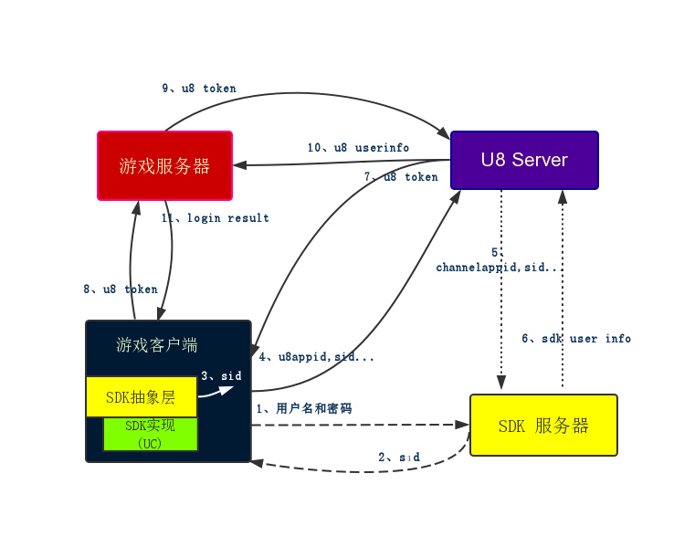
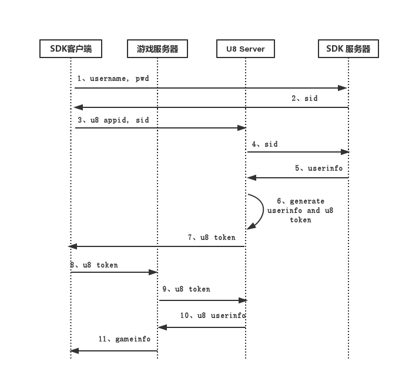

登录认证
==========

NOTE: 大部分渠道SDK都需要进行登录认证操作。客户端SDK登陆成功之后，渠道SDK一般会返回一个sessionId，token等数据，用于二次登录认证的凭据。
获取订单号，对应的类是：com.u8.server.web.UserAction

说明
----------

游戏客户端SDK登录成功之后，渠道SDK一般会返回token等数据，当玩具登录游戏的时候，游戏服务器需要用客户端传上来的token等数据，去SDK服务器进行登录认证，只有认证成功，才能允许当前用户登录。否则，登录失败。

U8Server采用统一的架构设计，将用户登录认证的操作集中在U8Server,作为一个所有游戏所有渠道的统一的用户登录认证中心。

如果游戏服务器去做这个登录认证工作，那么如果公司同时有多款游戏，那么每款游戏都需要做这个重复的工作。所以，最好的解决方案是，我们会将这个工作集中在一起，多个游戏都能直接用，而不用每个游戏都去重复实现。这就是U8Server的意义。

这样，我们就将每个游戏对多个渠道SDK服务器的流程，改成了每个游戏只对统一的U8Server，U8Server再对多个渠道SDK服务器的流程 。

流程
----------

使用U8Server之后，我们的整个登录流程变成了：



```
1、客户端接入抽象SDK框架，根据当前具体是哪个SDK渠道，调用登陆界面，然后传入用户名和密码，进行SDK登陆操作。

2、SDK登陆成功，会返回sid，token等信息。通过事件参数，传到U8SDK抽象层

3、抽象层在SDK登录成功之后，会收到登录成功的回调，回调参数中就是sid，token等数据，抽象层接下来直接去U8Server进行二次登录认证。

4、抽象层拿着这个sid以及接入之前向u8 server申请的appid,渠道号等信息，Http请求访问u8 server的登录认证接口地址进行登陆认证。

5、u8 server 根据当前传递的appid, 渠道号，去对应的SDK服务器进行认证

6、SDK服务器认证成功，会返回SDK服务器那边的用户信息

7、U8 Server拿到用户信息，生成一个u8 server统一的用户信息并存储。然后，紧接着返回给客户端一个有效的token，这个token是U8Server生成的。

8、客户端拿着这个token，去访问游戏服务器(多数是游戏登陆服务器)

9、游戏服务器，拿着这个token去u8 server 进行登陆认证。这个时候，仅仅是U8Server自己认证之前发给客户端饿token。不是去SDK认证，因为之前已经认证过了。

10、u8 server 判定token有效，则返回给游戏服务器当前用户的用户信息

11、游戏服务器拿到用户信息，证明当前登陆成功，返回给客户端服务器列表等数据，登陆成功。

```

同时，我们通过登录认证的时序图，可以更加直观地看清整个流程：



通过这个流程，我们可以看到，每个游戏服务器只需要和U8 Server 进行交互就可以了，全部由U8 Server进行第三方SDK的登陆认证操作。


接口
----------

NOTE: 如果你还没有搭建好U8Server的开发环境，建议你参考[这篇文档](u8server_setup.md)，先去搭建U8Server的开发环境。

假如你部署好了U8Server，并且根地址是http://localhost:8080/

1、渠道SDK的统一登录认证地址

渠道SDK登录成功之后，U8SDK抽象层会来U8Server进行渠道SDK的二次登录认证。这里的地址，就是各个渠道SDK统一的登录认证地址。

```

登录认证地址：http://localhost:8080/user/getToken
请求方式：POST或者GET
参数：
	appID：U8Server分配给当前游戏的appID
	channelID：当前客户端的渠道ID
	extension：当前渠道登录成功的参数(sid,token,sessionId等，一个或者多个)，这里格式各个渠道SDK可能不一样。
	sign：md5("appID="+appID+"channelID="+channelID+"extension="+extension+appKey);这里U8SDK抽象层按照格式，生成一个md5串，appKey是U8Server分配给游戏的AppKey

返回(JSON格式)：
	{ 
	  state: 1（登录认证成功）；其他失败
	  data: 认证成功才有数据，否则为空
	  	  {
	  	  	userID:U8Server生成的唯一用户ID
	  	  	sdkUserID:渠道SDK那里用户的ID
	  	  	username:U8Server返回统一格式的用户名
	  	  	sdkUserName:渠道SDK那里用户的用户名
	  	  	token:U8Server生成的token，用于游戏服务器登录认证使用
	  	  	extension:扩展数据字段。有特殊需求的数据可以在这里添加。
	  	  }
	}
```

2、游戏服务器登录认证地址

客户端去U8Server二次登录认证成功之后，U8Server返回客户端U8Server生成的token，客户端紧接着开始登录游戏，同时携带这个token，游戏服务器拿着这个token，要来U8Server进行一次登录认证。这个就是游戏服务器的登录认证地址。

```

登录认证地址：http://localhost:8080/user/verifyAccount
请求方式：POST或者GET
参数：
	userID：上面登录认证成功之后，U8Server返回的userID
	token：上面登录认证成功之后，U8Server返回的token
	sign：md5("userID="+userID+"token="+token+appKey);这里游戏服务器按照格式，生成一个md5串，appKey是U8Server分配给游戏的AppKey

返回(JSON格式)：
	{
	  state: 1(登录认证成功)；其他失败
	  data: 认证成功才有数据，否则为空
	      {
	      	userID:U8Server生成的唯一用户ID
	      	username:U8Server生成的统一格式的用户名
            channelID:渠道号
	  	}
	}

```


