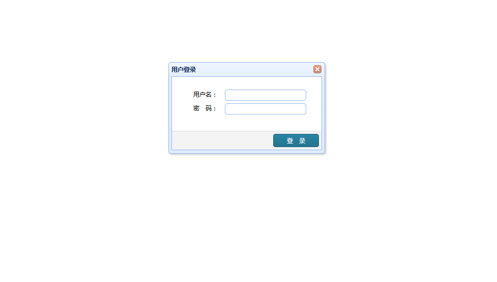
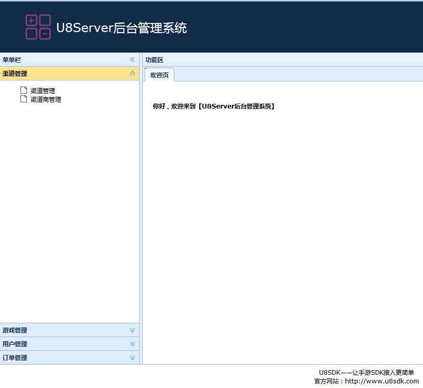
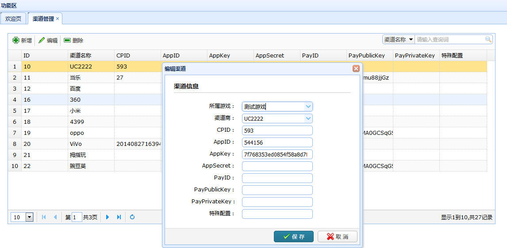
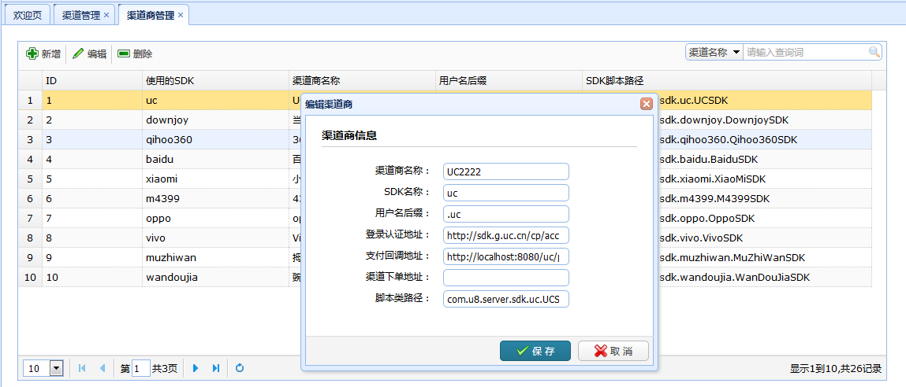
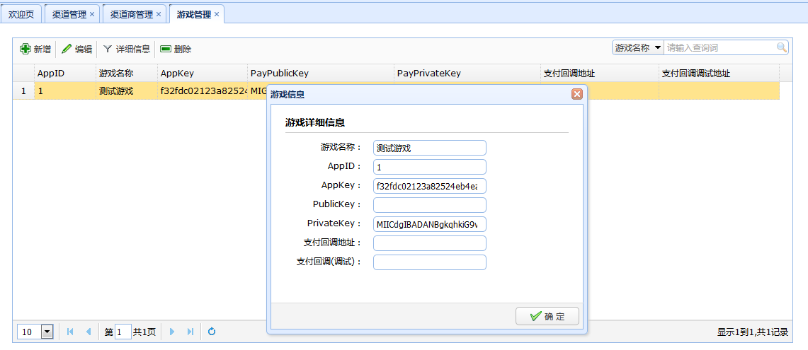

后台管理系统
============

NOTE: 如果你还没有搭建好U8Server的开发环境，建议你参考[这篇文档](u8server_setup.md)，先去搭建U8Server的开发环境。

假设你的U8Server根地址为: http://localhost:8080/，那么后台管理系统入口为http://localhost:8080/admin/login


U8Server企业版后台管理系统，在线演示地址：[U8Server演示地址](http://121.42.144.254/admin/index)
用户名和密码：admin/admin


登录
-------

默认的用户名和密码都是u8sdk



主界面
-------



当前U8Server后台管理系统中，主要有以下功能：

```
1、渠道管理：添加，修改，删除，查询
2、渠道商管理：添加，修改，删除，查询
3、游戏管理：添加，修改，删除，查询
4、用户管理：查询，删除，统计
5、订单管理：查询，删除，统计
```

渠道管理
--------



渠道的主要配置的参数如下

```
1、所属游戏：选择当前渠道是属于哪个游戏
2、渠道商：当前渠道是属于哪个渠道商的
3、CPID：渠道分配给当前游戏的cpID
4、AppID：渠道分配给当前游戏的appID
5、AppKey：渠道分配给当前游戏的AppKey
6、AppSecret：渠道分配给当前游戏的AppSecret
7、PayID：渠道分配给游戏的PayID
8、PayPublicKey：渠道分配给游戏的公钥
9、PayPrivateKey：渠道分配给游戏的私钥
10、特殊配置：当前渠道SDK的特殊配置

注意，上面这些参数，不是每个渠道都需要这么多。根据需要可以将参数配置在对应的字段，其他没有的留空。代码中使用的时候，根据配置，读取对应字段即可。

```

渠道商管理
----------



渠道商的主要配置的参数如下

```
1、渠道商名称：当前渠道商名称
2、SDK名称：当前渠道上使用的SDK名称
3、用户名后缀：登录认证的时候，U8Server生成的本地用户名的后缀
5、登录认证地址：当前渠道商的登录认证地址
6、支付回调地址：当前渠道商的支付回调地址(U8Server本地的支付回调地址)
7、渠道下单地址：如果渠道商有下单要求，这里配置下单地址
8、脚本类路径：当前渠道商，对应的SDK登录认证和下单实现类的完整类名。每个渠道SDK在接入的时候，都需要有一个实现了IScript接口的类。来实现当前渠道的登录认证操作和下单操作。这里就配置这个类。

```

游戏管理
---------



游戏的主要配置参数如下：

```
1、游戏名称：当前游戏名称
2、AppID：创建游戏时，U8Server生成的AppID,代表该游戏
3、AppKey：创建游戏时，U8Server生存的AppKey,用于客户端和U8Server进行交互验证的字段
3、AppSecret：创建游戏时，U8Server生成的AppSecret，用于游戏服务器和U8Server之间校验数据的密钥（不要放在客户端）
4、PublicKey：创建游戏时，U8Server生成的公钥，支付使用，下单和支付回调的时候，都需要用到
5、PrivateKey：创建游戏时，U8Server生成的私钥，和公钥对应。支付使用。
6、支付回调地址：U8Server处理渠道SDK支付回调成功之后，需要回调通知到游戏服。这里配置游戏服的通知地址
7、支付回调(调试)：测试使用

```

用户管理
--------


这里是用户第一次登录认证之后，U8Server会在本地生成一条用户数据，和渠道SDK的用户进行绑定。这里我们可以对这些用户，进行查询和统计。


订单管理
--------


这里是用户支付下单时，U8Server会生成一条订单数据，后续的操作，都是修改该订单的状态。我们可以对这些订单，进行查询和统计。

