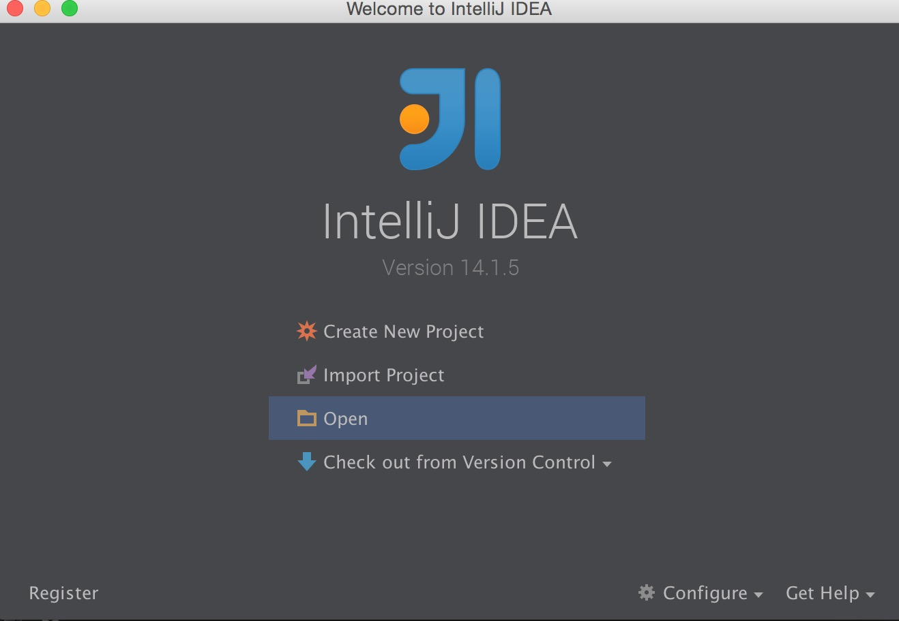
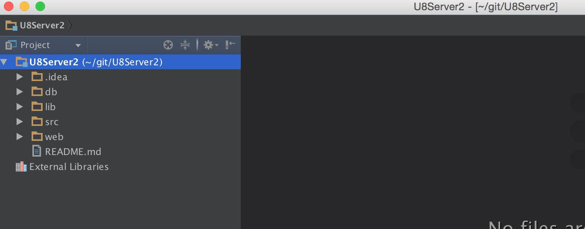
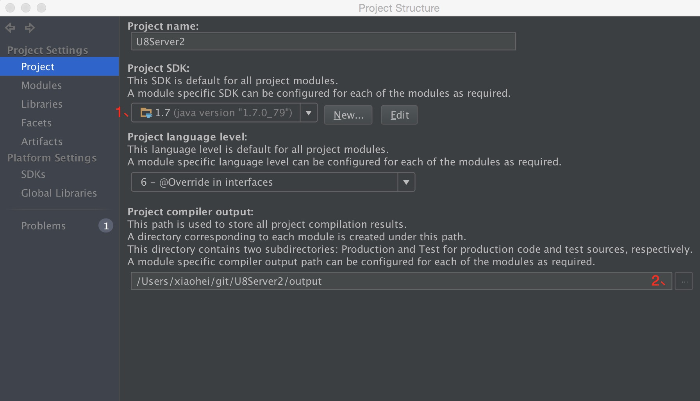
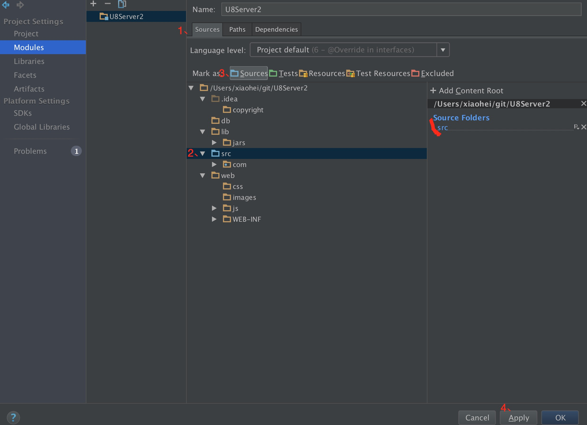
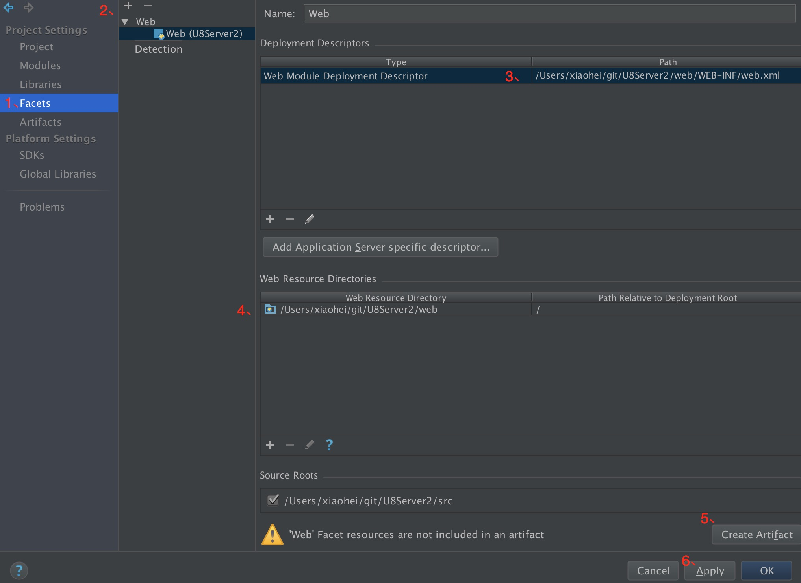
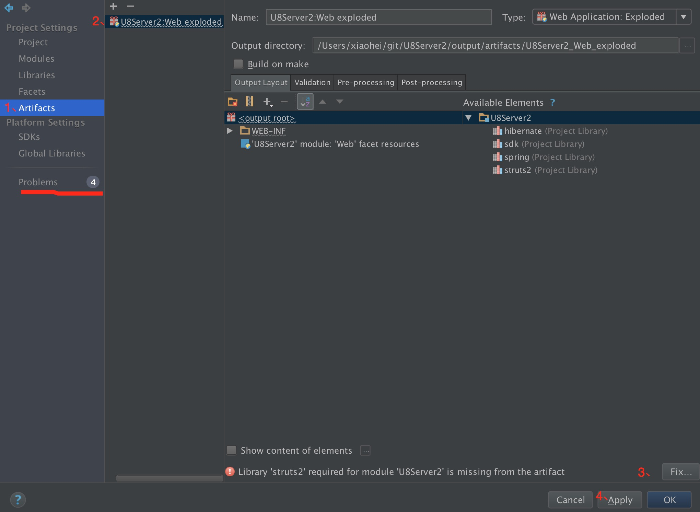
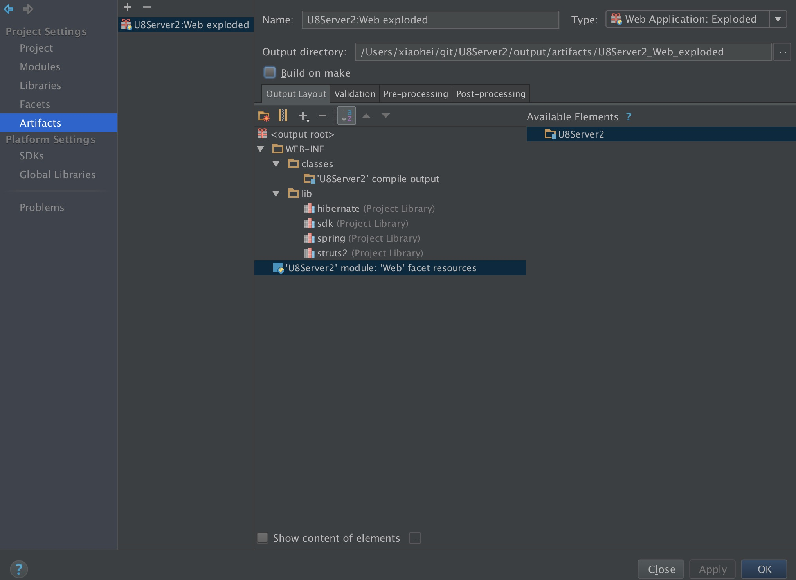
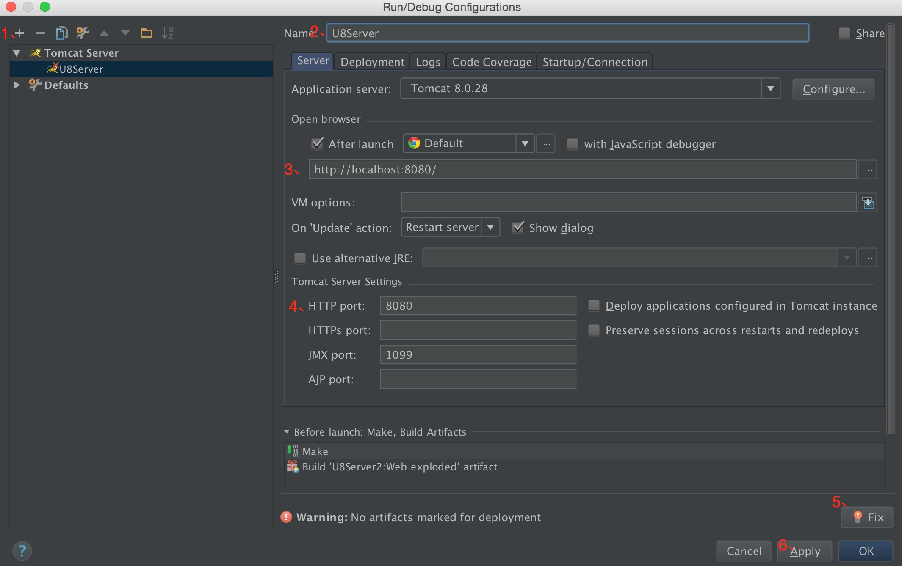

环境搭建
=========

NOTE:<font style='color:red;'>U8Server现在采用gradle构建了，同时我们为大家提供了视频教程，让大家能够快速地搭建和部署U8Server开发环境。这里的文档是使用gradle之前的文档，如果使用gradle构建方式之前的童鞋，这里的文档依然适用。视频教程地址:[U8Server视频教程](http://www.chuanke.com/2869716-164072.html)</font>

```
U8Server采用java web标准框架J2EE开发，所以，理论上，任何能够开发java web应用程序的IDE都可以用来开发U8Server，比如eclipse,myeclipse,intellij idea。我们这里，仅仅演示在Intellij IDEA 中从头导入U8Server，然后进行配置，最终能够直接跑起来的过程。
```

搭建 U8Server 需要以下环境:

jdk1.6或者jdk1.7版本
tomcat 6.0以上
mysql
java web开发环境


准备工作
---------

**1、准备jdk**

```
建议安装jdk1.7版本
```

如果你是windows用户，那么你可以参考下面这篇文章，来安装对应版本的jdk，注意自己是32位系统还是64位系统：

[windows下安装jdk](http://jingyan.baidu.com/article/48b558e35008cb7f38c09a3e.html)

如果你是Mac用户，那么你可以参考下面这篇文章，来安装对应版本的jdk，注意32位和64位。

[Mac下安装jdk](http://www.ifunmac.com/2013/04/mac-jdk-7/)

**2、准备Tomcat**

如果你是windows用户，那么可以参考下面这篇文章，来安装Tomcat，注意Tomcat版本要在6.0以上。建议安装Tomcat 7.x

[Windows下安装Tomcat](http://jingyan.baidu.com/article/624e7459a7d6e734e9ba5a70.html)

如果你是Mac 用户，那么可以参考下面这篇文章，来安装Tomcat：

[Mac下安装Tomcat](http://www.qinbin.me/homebrew-install-tomcat-under-mac/)

**3、准备MySql**

如果你是windows用户，那么可以参考下面这篇文章，来安装MySQL，注意MySQL版本要在5.0以上：

[Windows下安装MySQL](http://jingyan.baidu.com/article/f3ad7d0ffc061a09c3345bf0.html)

如果是Mac 用户，那么可以参考下面这篇文章，来安装Tomcat:

[Mac下安装MySQL](http://wgxsoft.blog.163.com/blog/static/1738191712015226159200/)

**4、安装IDEA**

去Intellij IDEA官方网站下载最新版本的IDEA进行安装，注意，我们要选择［Ultimate Edition］版本，因为只有这个版本，是支持Java Web开发的。另一个［Community Edition］功能有限，不支持Java Web开发。如果是windows用户，请下载windows版本；如果是mac用户，请下载mac版本。

[下载地址](http://www.jetbrains.com/idea/download/)

**5、准备 U8Server**

新建一个文件夹(U8Server2)，然后从U8Server的github远程分支上clone下来到这个目录。启动终端，执行：

```
git clone https://github.com/u8-xiaohei/U8Server.git

```

然后，我们打开IDEA，选择打开工程，打开刚刚clone下来的U8Server工程：



打开之后，我们看到如下结构：




环境配置
--------

NOTE:为了能够在IDEA中，直接运行并发布U8Server到Tomcat中，我们需要在IDEA中集成Tomcat。同时，我们需要对工程做一些设置，使得我们可以顺利地完成发布

在菜单File中，选择［Project Structure］打开该工程的配置。然后接下来，我们所有的配置都在这里：



1、在这里指定刚刚安装的jdk
2、这里设置该工程编译和发布目录，我们这里指定到工程目录/output



1、点击sources
2、选中src目录
3、点击Sources，这个可以看到右边红线标注的地方，src被标注为了Source Folder。同时，src文件夹的颜色也变了
4、点击Apply应用


1、点击Libraries，我们要添加依赖的库文件
2、点击＋号，选择java，然后定位到U8Server2/lib/jars目录下，我们有四个子目录：
	hibernate：hibernate的依赖库
	spring：spring的依赖库
	struts2：struts2的依赖库
	sdk：其他相关的需要的第三方库文件

我们需要将这四个子目录都添加进来。添加进来的时候，他会弹出一个弹窗，让你选择将当前的库添加到哪个modules中，直接默认确定即可。
3、点击Apply应用


1、点击Modules
2、点击Dependencies标签
3、选中我们刚刚添加进来的四个库
4、同时，需要注意Module SDK这里，需要指定选择为我们添加进来的jdk版本
5、点击Apply应用



1、点击Facet
2、点击＋，选择Web，创建一个Web的Facet，弹出的选择所属的Modules时，默认选择确定即可
3、修改Path，默认生成的Path是.idea目录下的，我们直接使用工程目录下的，所以选中，然后点击下面编辑的按钮，将.idea目录去掉
4、默认的Web Resource Directory也是.idea目录下的，我们将.idea目录去掉
5、下面有一个警告，说web资源没有饱含在artifact中，我们直接点击Create Artifact即可。
6、点击Apply应用



1、刚刚第五步Create Artifact之后，立马就会跳转到Artifact面板，我们需要设置一下，细心一点，可以看到左边Problems显示有四个问题。
2、选中 U8Server:Web exploded (默认应该就选中)，如果你这里没有这个，可以通过＋来手动添加
3、我们直接点击fix，因为有4个错误，所以我们选择Add all missing.....直接将4个库的编译输出到工程的输出目录
4、点击Apply应用

完成后如下：



OK，到这里，我们该工程的环境配置就完成了。

Tomcat集成
--------------

为了我们能够在IDEA中直接运行或者调试，我们需要将Tomcat继承进IDEA中，不过在IDEA中集成Tomcat是非常简单的


1、点击菜单Run－》Edit Configurations 打开运行配置面板，展开Default
2、往下拉，找到Tomcat Server，展开，选中Local
3、点击Confiure，指定我们之前安装的Tomcat目录，如果是Mac，注意指定到tomcat目录下libexec目录
4、这里我们将启动成功打开的url，改成U8Server后台登录地址
5、tomcat默认端口时8080，如果端口被别的应用占用了，你可以在这里进行修改。
6、点击＋号，选择Build Artifact，然后弹出的框中，选中U8Server:Web exploded，也就是我们之间创建的artifact
7、点击Apply应用

然后，还是刚刚那个界面，我们创建一个新的Tomcat配置实例：



1、点击+,选择Tomcat Server，选择Local，创建一个Tomcat配置实例
2、重命名一下为U8Server
3、设置一下启动起来打开的url地址
4、tomcat默认端口时8080，如果端口被别的应用占用了，你可以在这里进行修改。
5、下面警告：No artifacts marked for deployment 直接Fix即可
7、点击Apply应用

这样，我们就可以直接运行了，可以看到已经可以启动该U8Server了。你可以在Run菜单中看到Run 'U8Server'了，同时上面工具栏，运行那里默认也选择了U8Server作为默认的启动项了。

MySQL配置
------------

U8Server的数据存储在数据库，我们之前已经安装好了MySQL，我们接下来，将U8Server/db目录下的udb.sql导入到数据库中。
具体关于MySQL数据库的操作细节，自己Google科普一下，我们这里仅仅说一下步骤。

```
1、我们首先创建一个数据库用户，并设置密码。比如我们都设置为u8server
2、我们创建一个新的数据库，名为udb
3、然后在该数据库上进行导入我们的udb.sql，这里有各个表结构和测试数据
4、进入IDEA中，找到src目录下的jdbc.properties文件，打开：

jdbc.driver=com.mysql.jdbc.Driver
jdbc.url=jdbc:mysql://localhost:3306/udb
jdbc.username=u8server
jdbc.password=u8server
hibernate.dialect=org.hibernate.dialect.MySQLDialect
hibernate.show_sql=true
hibernate.hbm2ddl.auto=create
hibernate.current_session_context_class=thread

这里，我们主要注意jdbc.url,jdbc.username,jdbc.password三个属性。分别对应当前数据库的地址，用户名和密码，将其设置为我们刚刚创建的数据库，以及用户名和密码即可。
```

好了，到这里，整个环境就搭建好了，可以在IDEA中，Run 'U8Server' 或者 Debug 'U8Server'启动看看了。


